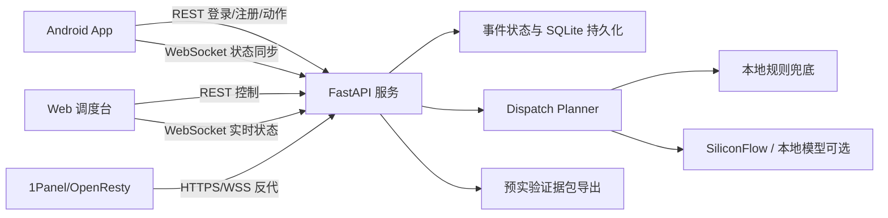

# 生命反射弧工程化升级与落地白皮书

## 1. 执行摘要

生命反射弧 LifeReflexArc 是面向公共场所疑似心脏骤停场景的 AI 急救协同原型系统。系统通过 Android App、Web 调度台、云端事件服务和 AI/规则分派引擎，把传统现场急救中容易串行化、口头化、不可追踪的协同行为，拆解为可下发、可解释、可记录的多角色并行任务。

当前阶段的核心目标不是宣称临床疗效，而是完成医创赛“交叉学科 / AI 创新设计”所需的可运行系统、医学应用场景、AI 技术贡献、医学相关验证数据和专家反馈闭环。

## 2. 比赛定位

赛道：交叉学科

亚组：第四组，AI 创新设计

匹配理由：

- 医学应用场景明确：公共场所疑似心脏骤停早期响应和急救演练。
- 医学实际问题明确：第一目击者分工混乱、AED 取送延迟、多人协同不可追踪。
- AI 技术贡献明确：基于人员画像、位置、AED 距离、健康风险的角色分派与解释。
- 医学相关验证路径明确：低成本模拟预实验 + 急诊/院前急救/护理专家反馈。

需要避免：

- 避免将项目包装成纯技术调度平台。
- 避免声称提升真实抢救成功率。
- 避免让 AI 替代急救规范、医生判断或 120 调度。

## 3. 产品边界

### 3.1 面向比赛的 MVP

必须完成：

- Web 调度台可访问。
- Android App 可安装，能连接云端事件。
- 模拟患者触发心脏骤停。
- 三类救援角色自动分派：核心施救、AED 保障、环境清障。
- AED 点位参与调度解释。
- CPR/AED/救护接管流程可被记录。
- 实验数据可导出。
- 可离线于第三方 API Key 运行演示模式。

### 3.2 后续生产化边界

真实生产落地前必须补齐：

- 医学合规审查。
- 隐私合规和数据最小化。
- 真实定位权限和地图服务备案。
- 推送能力、弱网策略、后台保活策略。
- 安全审计、日志审计和应急回滚。
- 与院前急救系统或校内安保系统的职责边界协议。

## 4. 当前架构

## 5. 已完成的工程化升级

### 5.1 后端

- 增加运行与测试依赖文件。
- 增加客户端位置模型。
- 增加 AED 点位模型。
- 增加演示场景初始化接口。
- 增加实验数据 JSON 与 ZIP 证据包导出接口。
- 调度服务返回角色分派、来源和可解释理由。
- 调度评分纳入人员能力、健康风险、患者距离、AED 距离。
- AI 不可用时规则兜底仍可运行。
- 增加可选演示管理员口令，保护公网演示的创建、重置、触发、导出和 AED 管理接口。
- 终端位置更新复用登录态，避免任意 userId 伪造位置污染调度输入。
- 后端单元测试覆盖 demo bootstrap、AED、location、export、dispatch rationale。

### 5.2 Web 调度台

- 增加“初始化医创赛演示场景”入口。
- 增加“导出预实验证据包”入口。
- 展示 AED 点位库。
- 展示终端模拟位置。
- 展示 AI/规则分派过程。
- 展示每个角色的评分、理由、距离和风险提示。
- 修复模板 UI 组件与当前依赖版本的 TypeScript 兼容问题。

### 5.3 Android

- 增加生产域名配置默认值。
- 增加位置数据模型。
- 支持注册终端时携带模拟位置。
- 增加位置更新接口调用。
- Gradle 工程可识别并列出任务。

当前 debug APK 已可出包。后续如需正式比赛包，应生成 release keystore 并改用 release 签名。

### 5.4 文档与比赛材料

- 第三方资源准备清单。
- 低成本预实验方案。
- 专家反馈表。
- 部署运行手册。
- 长任务状态和阻塞记录。

## 6. 核心数据模型

### 6.1 终端画像

- 用户 ID、姓名、组织、健康状况、职业身份、个人简介。
- 在线状态、最近上线时间。
- 是否患者候选、是否当前患者。
- 当前分配角色。
- 模拟或真实位置。

### 6.2 AED 点位

- 点位 ID、名称。
- 经纬度、楼层、位置标签、精度。
- 可用状态。
- 取用说明。
- 最近检查时间。

### 6.3 调度解释

- 角色：PRIME / RUNNER / GUIDE。
- 被选用户。
- 分数。
- 正向理由。
- 风险提示。
- 到患者距离。
- 到 AED 距离。
- AED 到患者距离。

## 7. 预实验证据链

比赛材料中的证据链建议这样组织：

1. 医学问题：心脏骤停黄金时间内，多人协同容易混乱。
2. 技术方案：AI/规则调度将人员画像、位置、AED 点位转化为角色任务。
3. 系统实现：App + Web + 云端 + WebSocket + 预实验证据包。
4. 预实验：模拟场景中采集关键时间线和主观评分。
5. 专家反馈：医学专家评价流程合理性、安全边界和改进方向。
6. 结论：系统具备急救演练与协同训练价值，仍需进一步真实场景验证。

## 8. 安全与合规风险

| 风险 | 当前策略 | 后续策略 |
| --- | --- | --- |
| 误导真实医疗决策 | 文案限定为模拟和训练 | 加强免责声明与急救规范引用 |
| AI 分派错误 | 规则兜底 + 解释输出 | 专家规则库、风险黑名单、人工确认 |
| 位置不准确 | 显示精度和来源 | 接入地图 SDK、室内定位或手动校正 |
| 个人隐私 | 预实验匿名化 | 权限分级、脱敏、审计日志 |
| 公网演示被重置或污染 | 可配置 `LRA_DEMO_ADMIN_TOKEN` | 分角色鉴权、后台管理账号、操作审计 |
| 服务不可用 | 单机原型 | systemd、备份、监控、灰度发布 |
| 证书/域名配置混乱 | 1Panel 管理 | 自动化脚本写入 1Panel 记录并备份 |

## 9. 里程碑计划

### M1：比赛演示闭环

- 本地后端测试通过。
- Web build/typecheck 通过。
- 云端网站可访问。
- 演示场景一键初始化。
- 预实验证据包可导出，包含审阅索引、原始 JSON、匿名化 JSON/CSV、结构化时间线、指标表、调度依据、专家摘要、专家复核清单、专家反馈签字表、主持人跑场单、数据分析说明、数据字典、参与者知情与安全边界简表、观察员记录表、参与者问卷、基线-系统对照分析表、单轮汇总表和 manifest 校验信息。

### M2：APK 可安装

- 安装 Android SDK。
- 生成 debug APK。
- 固定 release keystore。
- 配置正式包名和签名 SHA1。
- 真机连接云端事件。

### M3：第三方资源

- 高德或腾讯地图 Key。
- AI API Key。
- HTTPS/WSS 正式可用。
- 服务器 `.env` 配置完成。

### M4：预实验

- 完成 8-16 人模拟演练。
- 导出系统预实验证据包，优先使用审阅索引、匿名化 JSON/CSV、专家摘要、专家复核清单、专家反馈签字表、主持人跑场单、数据分析说明、数据字典、参与者知情与安全边界简表、观察员记录表、参与者问卷、基线-系统对照分析表和单轮汇总表形成材料。
- 整理观察记录和问卷。
- 形成图表和结论。

### M5：专家反馈

- 准备演示材料包。
- 邀请 1-3 位专家审阅。
- 收集签字反馈。
- 按专家意见修正文案和系统。

## 10. 答辩叙事建议

一句话定位：

生命反射弧是一个面向心脏骤停模拟急救场景的 AI 多端协同系统，用可解释调度把“谁按压、谁取 AED、谁清障接应”在黄金时间内快速组织起来，并把全过程转化为可复盘的实验数据。

三点创新：

- 从“单人学习急救”转为“多人现场协同”。
- 从“口头分工”转为“AI/规则可解释分派”。
- 从“演练后凭记忆复盘”转为“自动导出时间线和调度证据”。

三点谨慎表达：

- 本项目用于模拟演练和辅助协同，不替代 120 和专业急救人员。
- 预实验验证的是流程可行性和可用性，不验证临床疗效。
- AI 的价值在于辅助分派和解释，不直接作出医疗诊断。

## 11. 当前验证结果

- 后端测试：22 项通过。
- 前端 TypeScript 检查：通过。
- 前端生产构建：通过。
- Android Gradle 任务发现：通过。
- Android APK 组装：debug APK 已生成，使用 Android debug 签名。

## 12. 下一步最优先事项

1. 真机安装 debug APK，完整走通登录、连接云端事件、响应任务和现场总览。
2. 将当前版本部署到 `lifereflex.mddcommunity.top`。
3. 申请地图与 AI API Key，并仅写入服务器 `.env`。
4. 组织 2-4 轮低成本预实验。
5. 请急诊/护理/院前急救相关专家签署反馈表。
